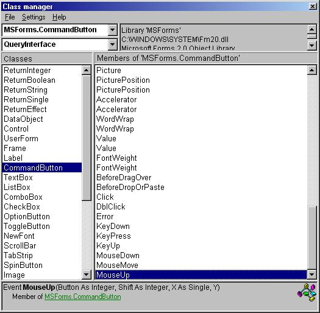



## EXE/DLL/OCX/OCA/TLB Type\-library decompiler

### Description

This program will decompile/read and interpret ANY type library. A type library is a library in some DLL's, EXE's and all OCX,OCA and TLB files. It contains information like function, parameters, descriptions, events, subroutines, properties, GUID ext.
 
### More Info
 
You need:

Windows common controls 6.0 (standard with VB6)

Common dialog control 6.0  (standard with VB6)

Rich Text Box control 6.0  (standard with VB6)

             |
---                |---
**Submitted On**   |2000-12-27 15:19:12
**By**             |[N/A](https://github.com/Planet-Source-Code/PSCIndex/blob/master/ByAuthor/empty.md)
**Level**          |Intermediate
**User Rating**    |4.1 (70 globes from 17 users)
**Compatibility**  |VB 5\.0, VB 6\.0
**Category**       |[Complete Applications](https://github.com/Planet-Source-Code/PSCIndex/blob/master/ByCategory/complete-applications__1-27.md)
**World**          |[Visual Basic](https://github.com/Planet-Source-Code/PSCIndex/blob/master/ByWorld/visual-basic.md)
**Archive File**   |[CODE\_UPLOAD1307812262000\.zip](https://github.com/Planet-Source-Code/exe-dll-ocx-oca-tlb-type-library-decompiler__1-13892/archive/master.zip)

